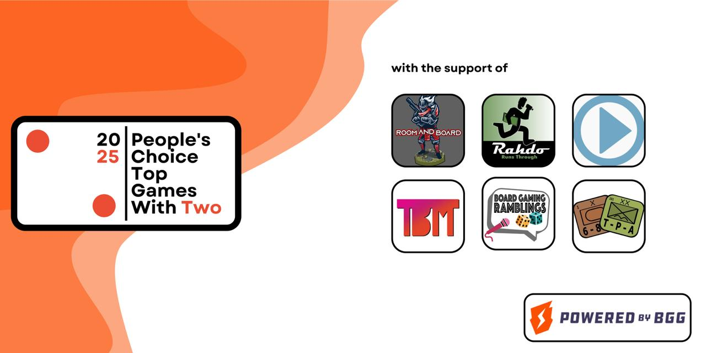

# BGG's top 200 games at 2: data repository
This repository is a work in progress. 

### Tip jar
If you wish to donate or to support specific initiatives (e.g., finance the yearly survey or sponsor a prize), you can do so by clicking here:

For requests or questions, feel free to reach out via geekmail [here](https://boardgamegeek.com/user/Dr_Bewd).

### Overview
The user who collected data between 2019 and 2020 deleted the results and, unfortunately, all available snapshot in the Wayback Machine are blank. The user who worked on the top 200 from 2021 to 2022 clearly had access to the data (unclear whether he had a complete dataset or just the aggregated statistics), but he never replied to any of my querries. Data for 2019-2020 were retroactively pieced together using the info available in later geeklists and blog posts from that period, but there are major blind spots. Data for 2021-2022 were instead retrieved directly from the existing geeklists, but individual-level data and information about games that received less than 2 votes are unavailable. Finally, available aggregated statistics for games that didn't make it to the top 200 during these years are limited.

If you're looking for something that was originally posted on BGG, our [central HUB](https://boardgamegeek.com/thread/3430158/top-games-with-two-central-hub-thread) probably has the right link for you.

### Links to interactive network visualizations (not mobile-friendly)
| Year | Repository | Visualization |
| --- | --- | --- |
| 2023 | [__φ(．．)](https://github.com/DrBewd/BGG_top200_at_2_2023) | [⸜(｡˃ ᵕ ˂ )⸝](https://drbewd.github.io/BGG_top200_at_2_2023/#) |
| 2024 | [__φ(．．)](https://github.com/DrBewd/BGG_top200_at_2_2024) | [⸜(｡˃ ᵕ ˂ )⸝](https://drbewd.github.io/BGG_top200_at_2_2024/#) |

### Internet Archive Wayback Machine
Some of the past content was deleted from BGG. I tried to retrieve those information from the Wayback Machine, but unfortunately the available snapshots were all blank. To avoid similar issues in future, I updated all the snapshots for currently available content page by page. If the need arises again, all the links can be found here:

*Note: It looks like the Wayback Machine struggles to render geeklists for some reason and even the new snapshots are now not visualized correctly

| Year | Page | Link |
| --- | --- | --- |
| 2019 | 1 | [( ╯°□°)╯ ┻━━┻](https://web.archive.org/web/20240000000000*/https://boardgamegeek.com/geeklist/330084/peoples-choice-two-archival-series-2019) |
| 2019 | 2 | [( ╯°□°)╯ ┻━━┻](https://web.archive.org/web/20240000000000*/https://boardgamegeek.com/geeklist/330084/peoples-choice-two-archival-series-2019?page=2) |
| 2019 | 3 | [( ╯°□°)╯ ┻━━┻](https://web.archive.org/web/20240000000000*/https://boardgamegeek.com/geeklist/330084/peoples-choice-two-archival-series-2019?page=3) |
| 2019 | 4 | [( ╯°□°)╯ ┻━━┻](https://web.archive.org/web/20240000000000*/https://boardgamegeek.com/geeklist/330084/peoples-choice-two-archival-series-2019?page=4) |
| 2020 | 1 | Temporarily down, will update ASAP | 
| 2020 | 2 | Temporarily down, will update ASAP |
| 2020 | 3 | Temporarily down, will update ASAP |
| 2020 | 4 | Temporarily down, will update ASAP |
| 2020 | 5 | Temporarily down, will update ASAP |
| 2021 | 1 | [( ╯°□°)╯ ┻━━┻](https://web.archive.org/web/20240000000000*/https://boardgamegeek.com/geeklist/292379/2021-peoples-choice-top-games-two-1-200) |
| 2021 | 2 | [( ╯°□°)╯ ┻━━┻](https://web.archive.org/web/20240000000000*/https://boardgamegeek.com/geeklist/292379/2021-peoples-choice-top-games-two-1-200?page=2) |
| 2021 | 3 | [( ╯°□°)╯ ┻━━┻](https://web.archive.org/web/20240000000000*/https://boardgamegeek.com/geeklist/292379/2021-peoples-choice-top-games-two-1-200?page=3) |
| 2021 | 4 | [( ╯°□°)╯ ┻━━┻](https://web.archive.org/web/20240000000000*/https://boardgamegeek.com/geeklist/292379/2021-peoples-choice-top-games-two-1-200?page=4) |
| 2021 | 5 | [( ╯°□°)╯ ┻━━┻](https://web.archive.org/web/20240000000000*/https://boardgamegeek.com/geeklist/292379/2021-peoples-choice-top-games-two-1-200?page=5) |
| 2021 | 6 | [( ╯°□°)╯ ┻━━┻](https://web.archive.org/web/20240000000000*/https://boardgamegeek.com/geeklist/292379/2021-peoples-choice-top-games-two-1-200?page=6) |
| 2021 | 7 | [( ╯°□°)╯ ┻━━┻](https://web.archive.org/web/20240000000000*/https://boardgamegeek.com/geeklist/292379/2021-peoples-choice-top-games-two-1-200?page=7) |
| 2021 | 8 | [( ╯°□°)╯ ┻━━┻](https://web.archive.org/web/20240000000000*/https://boardgamegeek.com/geeklist/292379/2021-peoples-choice-top-games-two-1-200?page=8) |
| 2021 | 9 | [( ╯°□°)╯ ┻━━┻](https://web.archive.org/web/20240000000000*/https://boardgamegeek.com/geeklist/292379/2021-peoples-choice-top-games-two-1-200?page=9) |
| 2022 | 1 | [( ╯°□°)╯ ┻━━┻](https://web.archive.org/web/20240000000000*/https://boardgamegeek.com/geeklist/307302/2022-peoples-choice-top-games-two-1-200) |
| 2022 | 2 | [( ╯°□°)╯ ┻━━┻](https://web.archive.org/web/20240000000000*/https://boardgamegeek.com/geeklist/307302/2022-peoples-choice-top-games-two-1-200?page=2) |
| 2022 | 3 | [( ╯°□°)╯ ┻━━┻](https://web.archive.org/web/20240515000000*/https://boardgamegeek.com/geeklist/307302/2022-peoples-choice-top-games-two-1-200?page=3) |
| 2022 | 4 | [( ╯°□°)╯ ┻━━┻](https://web.archive.org/web/20240515000000*/https://boardgamegeek.com/geeklist/307302/2022-peoples-choice-top-games-two-1-200?page=4) |
| 2022 | 5 | [( ╯°□°)╯ ┻━━┻](https://web.archive.org/web/20240515000000*/https://boardgamegeek.com/geeklist/307302/2022-peoples-choice-top-games-two-1-200?page=5) |
| 2022 | 6 | [( ╯°□°)╯ ┻━━┻](https://web.archive.org/web/20240515000000*/https://boardgamegeek.com/geeklist/307302/2022-peoples-choice-top-games-two-1-200?page=6) |
| 2022 | 7 | [( ╯°□°)╯ ┻━━┻](https://web.archive.org/web/20240515000000*/https://boardgamegeek.com/geeklist/307302/2022-peoples-choice-top-games-two-1-200?page=7) |
| 2022 | 8 | [( ╯°□°)╯ ┻━━┻](https://web.archive.org/web/20240515000000*/https://boardgamegeek.com/geeklist/307302/2022-peoples-choice-top-games-two-1-200?page=8) |
| 2022 | 9 | [( ╯°□°)╯ ┻━━┻](https://web.archive.org/web/20240515000000*/https://boardgamegeek.com/geeklist/307302/2022-peoples-choice-top-games-two-1-200?page=9) |
| 2023 | 1 | [( ╯°□°)╯ ┻━━┻](https://web.archive.org/web/20240000000000*/https://boardgamegeek.com/geeklist/328691/2023-peoples-choice-top-games-two-200-1) |
| 2023 | 2 | [( ╯°□°)╯ ┻━━┻](https://web.archive.org/web/20240000000000*/https://boardgamegeek.com/geeklist/328691/2023-peoples-choice-top-games-two-200-1?page=2) |
| 2023 | 3 | [( ╯°□°)╯ ┻━━┻](https://web.archive.org/web/20240000000000*/https://boardgamegeek.com/geeklist/328691/2023-peoples-choice-top-games-two-200-1?page=3) |
| 2023 | 4 | [( ╯°□°)╯ ┻━━┻](https://web.archive.org/web/20240000000000*/https://boardgamegeek.com/geeklist/328691/2023-peoples-choice-top-games-two-200-1?page=4) |
| 2023 | 5 | [( ╯°□°)╯ ┻━━┻](https://web.archive.org/web/20240000000000*/https://boardgamegeek.com/geeklist/328691/2023-peoples-choice-top-games-two-200-1?page=5) |
| 2023 | 6 | [( ╯°□°)╯ ┻━━┻](https://web.archive.org/web/20240000000000*/https://boardgamegeek.com/geeklist/328691/2023-peoples-choice-top-games-two-200-1?page=6) |
| 2023 | 7 | [( ╯°□°)╯ ┻━━┻](https://web.archive.org/web/20240000000000*/https://boardgamegeek.com/geeklist/328691/2023-peoples-choice-top-games-two-200-1?page=7) |
| 2023 | 8 | [( ╯°□°)╯ ┻━━┻](https://web.archive.org/web/20240000000000*/https://boardgamegeek.com/geeklist/328691/2023-peoples-choice-top-games-two-200-1?page=8) |
| 2023 | 9 | [( ╯°□°)╯ ┻━━┻](https://web.archive.org/web/20240000000000*/https://boardgamegeek.com/geeklist/328691/2023-peoples-choice-top-games-two-200-1?page=9) |
| 2024 | TBD | TBD |
